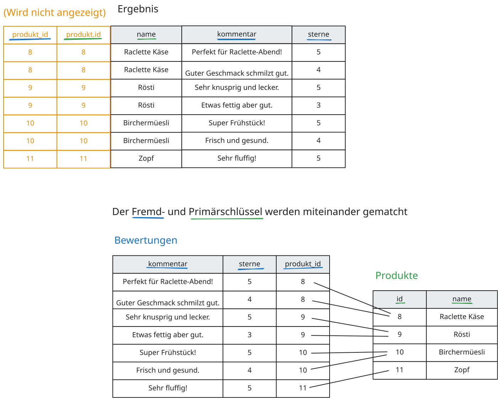

# Index

Dieser Bereich ist für die Dokumentation einer kleinen Library vorbereitet.

## Inhalt

- [Getting Started](/library/getting-started)

## Ziel

Dokumentiere hier Installation, API-Ideen, Beispiele und künftige Releases.

## Beispiel für ein automatisch exportiertes Diagramm

Die folgende Grafik wird aus `docs/assets/diagrams/diagram.excalidraw.json` automatisch nach `docs/assets/images/diagram.svg` exportiert und kann dann normal in Markdown eingebunden werden.

