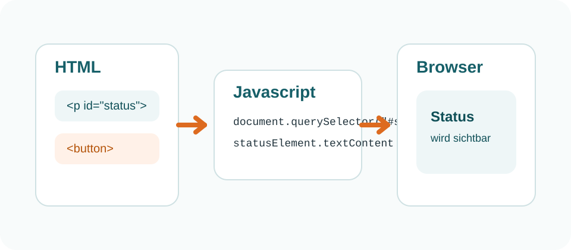

# HTML Elemente ansprechen

Damit Javascript etwas auf einer Website verändern kann, muss der Code zuerst ein Element im DOM finden. Häufig geschieht das mit `document.querySelector(...)`.

## Beispielbild

## Beispiel aus einer echten Quelldatei

Die folgende Codebox wird direkt aus `docs/examples/dom-demo/main.js` importiert:

<<< @/examples/dom-demo/main.js#query-example

## Typische Selektoren

- `#status` wählt ein Element über seine ID.
- `.card` wählt das erste Element mit dieser Klasse.
- `button` wählt das erste passende HTML-Element.
